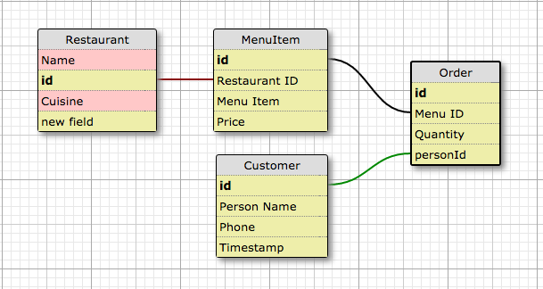

#   Restaurant Delivery Service
Version 0.0.0: October 4th, 2016

by
* [Shelby Clayton](https://github.com/Shabis)
* [Nhat Hoang](https://github.com/hoangnh092185)
* [Vanessa Palacios Sharma](https://github.com/VanessaSharma)
* [Georgina Van Dort](https://github.com/GeorginaVanDort)

## Description
Local food delivery service.

### Specifications
#### User Stories:

#### Database Diagram:

#### Technical Specifications:

## Setup/Installation
* Clone directory
* Setup database in PSQL:
  * Production Database: food_delivery
  * Development Database: food_delivery_test
  * Table Names: restaurants, menuitems, orders, customers
  * CREATE TABLE customers(id serial PRIMARY KEY, name varchar, phone varchar, ordertime timestamp);
* Type 'gradle run' inside the directory
* Navigate to 'http://localhost:4567'

## Support & Contact
For questions, concerns, or suggestions please email vanelunapalacios@live.com

## Known Issues
* N/A

## Technologies Used
Java, JUnit, Spark, PostgreSQL, Gradle

## Legal
*Licensed under the GNU General Public License v3.0*

Copyright (c) 2016 Copyright _Vanessa Palacios Sharma_ All Rights Reserved.
